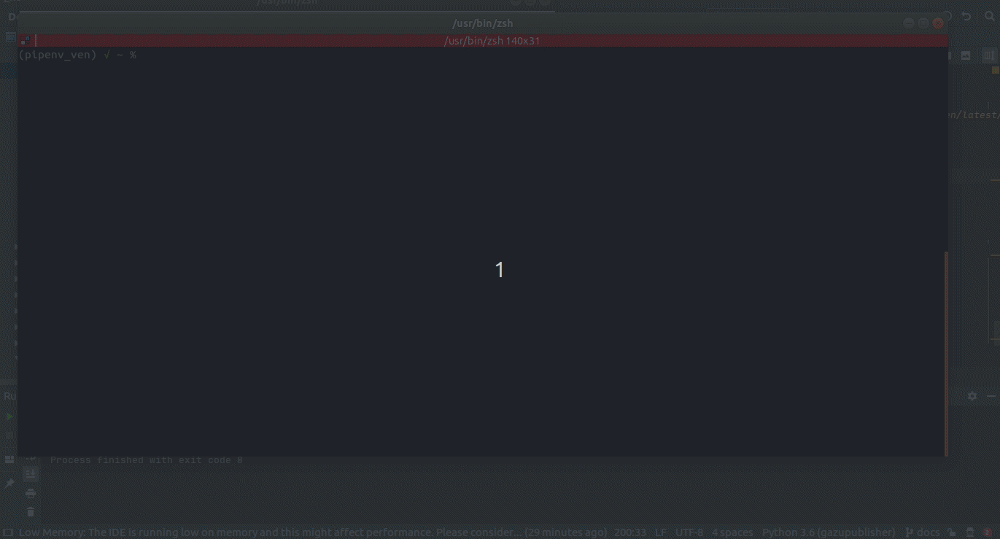
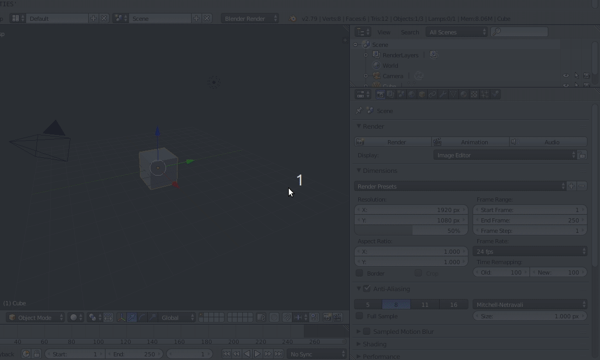
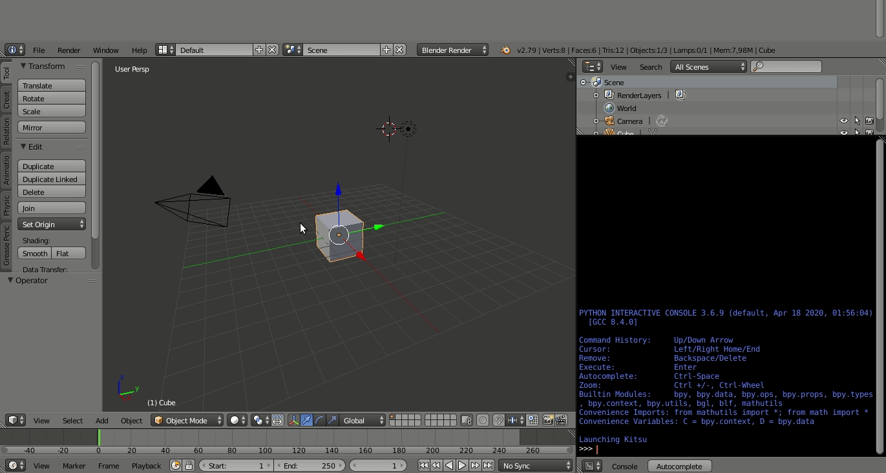
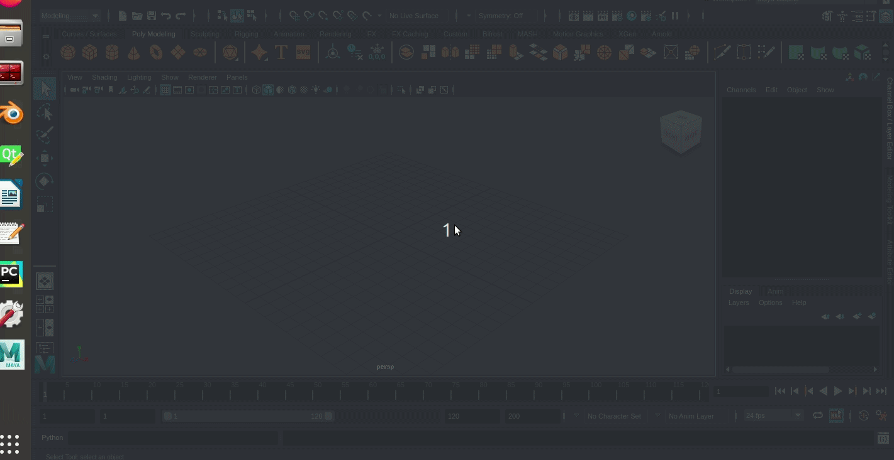
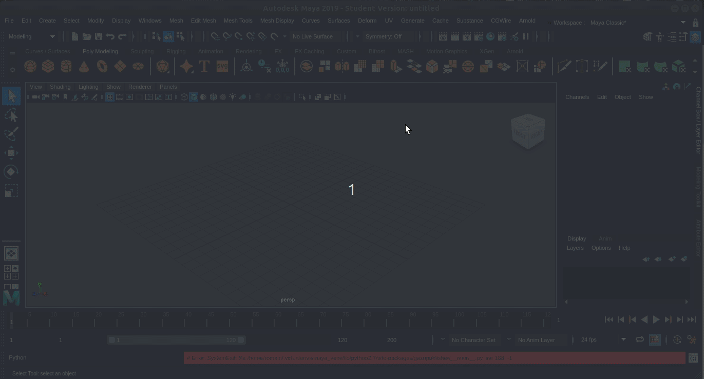

# Gazu publisher

The gazu publisher is a tool to send previews to Kitsu from your DCC.

For now, it is only available on Linux, and for the following softwares : Blender and Maya.


## Installation

**Disclaimer:**

The following procedure intends to give easy steps to install the gazu publisher
following the context you're targeting (Standalone, Blender, Maya, ...).

However, depending on your own local architecture, you might want to take
some liberties from this tutorial, which details a procedure to:

- Create a virtual environment
- Install the gazu publisher inside this virtual environment
- Setup the link file between the gazu publisher and your software

Please note that these steps can (must) be adapted to your own local
organisation regarding virtual environments, third-party packages, local scripts, etc...

You can now follow the tutorial corresponding to your targeted context (Standalone,
Blender, Maya, ...)

*Requirement: Make sure you have a zou instance running.*


### Standalone

First, we recommend to install the code in a virtual environment.
If you wish so, you can begin by installing a virtual environment manager (for example [virtualenv](https://virtualenv.pypa.io/en/latest/)):

```sh
pip install virtualenv
```

Then create a new virtual environment and activate it. Depending on the targeted software, you might want to specify a Python executable for the environment (even if it's not necessary):

```sh
mkvirtualenv --python <your_python_executable> gazu_publisher_venv
workon gazu_publisher_venv
```

Then we must install one of the Python Qt bindings, either PyQt5 or PySide2:

```sh
pip install PyQt5
```
or
```sh
pip install PySide2
```

Once it's done, we can install the gazu publisher:

```sh
pip install https://github.com/cgwire/gazu-publisher.git
```

And that's it ! You can launch the publisher with:

```sh
gazupublisher
```



If everything works properly you should see the login window appear.

### Blender

First, we recommend to install the code in a virtual environment.
If you wish so, you can begin by installing a virtual environment manager (for example [virtualenv](https://virtualenv.pypa.io/en/latest/)):

```sh
pip install virtualenv
```

Then create a new virtual environment and activate it.
To ensure version coherence, we must first find the Python used by Blender.
To do that, open your Blender console, and type `bpy.app.binary_path_python`, like in the following gif :



Now with the executable you just found, create the virtual environment :

```sh
mkvirtualenv --python <your_python_executable> gazu_publisher_venv
workon gazu_publisher_venv
```

Once it's done, we can install the gazu publisher:

```sh
pip install git+https://github.com/cgwire/gazu-publisher.git
```

Since Blender does not natively provide any Qt binding (PyQt or PySide), 
we also need to install either PyQt5 or PySide2 :

```sh
pip install PyQt5
```
or
```sh
pip install PySide2
```

Great, the code has been installed ! You can verify that everything is fine by launching:

```sh
gazupublisher
```

Now we need to link the publisher and Blender.

In the project, and more precisely in the folder `gazupublisher/software_link/blender`, 
we've provided an add-on `launch_kitsu.py` to link the publisher and Blender.
This add-on does three things :

- It adds the path of the gazu publisher to the sys.path variable.
- It makes work together the Qt and Blender event loops
- It adds the adequate component to the Blender UI (Window > Launch Kitsu)

To complete the file, you must manually set the `gazupublisher_folder` variable 
at the beginning of the file: open it and fill the variable with the path of the folder containing the project.
The path should look like `path_to_virtual_env/lib/python3.X/site-packages`
You can get it with the command:
```sh
pip show gazupublisher
```
You can also set in this file the variable `kitsu_host` with the URL of your 
instance of Kitsu, so that the users won't have to fill it every time.

Once the file is set up, the final step is to move the add-on in the start-up folder of Blender.
Usually this start-up folder can be found at `~/.config/blender/<version>/scripts/startup`
Note that if the startup folder doesn't exist, you may have to create it.
For more info on this folder, please refer to the official Blender [documentation](https://docs.blender.org/manual/en/latest/advanced/blender_directory_layout.html).

Once it's done, the installation is complete ! 
You can now launch the gazu publisher from Blender:




### Maya

First, we recommend to install the code in a virtual environment.
If you wish so, you can begin by installing a virtual environment manager (for example [virtualenv](https://virtualenv.pypa.io/en/latest/)):

```sh
pip install virtualenv
```

Then create a new virtual environment and activate it.
To ensure version coherence, we must first find the Python used by Maya.
Usually it can be found at `/usr/Autodesk/maya20xx/bin/mayapy`
For more info, please refer to the official Maya [documentation](https://knowledge.autodesk.com/support/maya/learn-explore/caas/CloudHelp/cloudhelp/2016/ENU/Maya/files/GUID-83799297-C629-48A8-BCE4-061D3F275215-htm.html).

Now with the executable you just found, create the virtual environment :

```sh
mkvirtualenv --python <your_python_executable> gazu_publisher_venv
workon gazu_publisher_venv
```

Once it's done, we can install the gazu publisher:

```sh
pip install git+https://github.com/cgwire/gazu-publisher.git
```

Great, the code has been installed !
Now we need to link the publisher and Maya.

In the project, and more precisely in the folder `gazupublisher/software_link/maya`, 
we've provided a start-up file `userSetup.py` to link the publisher and Maya.
This file does two things :

- It adds the path of the gazu publisher to the sys.path variable.
- It adds the adequate component to the Maya UI

To complete the file, you must manually set the `gazupublisher_folder` variable 
at the beginning of the file: open it and fill the variable with the path of the folder containing the project.
You can get this path with the command:

```sh
pip show gazupublisher
```

You can also set in this file the variable 'kitsu_host' with the URL of your 
instance of Kitsu, so that the user won't have to fill it every time.

Once the file is set up, the final step is to move the file in the start-up folder of Maya.
Usually this start-up folder is `~/maya/20xx/scripts/`.
You can also find its path with the MEL command `internalVar -usd`




Once it's done, the installation is complete ! 
You can now launch the gazu publisher from Maya:




## Troubleshooting

If you're on Ubuntu/Debian and you encounter any bug on Maya regarding a failed ssl import, this may be caused by Maya itself.
If then you observe a problem (for example missing libssl and libcrypto librairies) when launching this command :

```sh
ldd /usr/autodesk/mayaXXXX/lib/python2.7/lib-dynload/_ssl.so
```

Then please check the folder /usr/autodesk/mayaXXXX/support/python/2.7.11 and follow the instructions given by Maya.
If that last path leads to nowhere, you can try to find it with "locate ubuntu_ssl.so"
